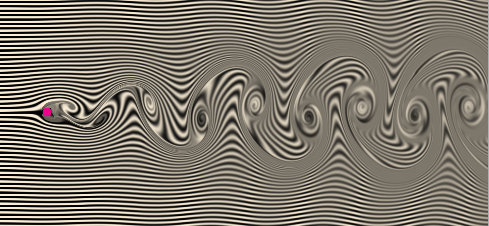
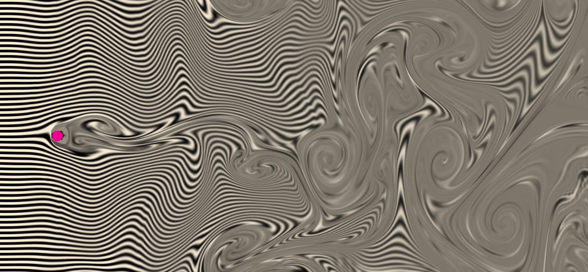

# VortexShedding
A realtime fluid flow simulation on the GPU using WebGL

Live demo at <a href="http://git.amandaghassaei.com/VortexShedding/" target="_blank">git.amandaghassaei.com/VortexShedding/</a>

This simulation solves the <a href="https://en.wikipedia.org/wiki/Navier%E2%80%93Stokes_equations" target="_blank">Navier-Stokes equations</a> for incompressible fluid flow past an obstacle in a GPU fragment shader.
It exhibits a phenomenon called <a href="https://en.wikipedia.org/wiki/Vortex_shedding" target="_blank">vortex shedding</a>,
where vortices of alternating spin spontaneously emerge behind the obstacle.
To increase performance, I solved for the velocity vector field of the fluid at a lower resolution than I used to compute the distribution of material moving through the fluid (shown in black and white).
I used bilinear interpolation to smooth out most artifacts caused by this speedup - though you can still see some artifacts around the boundary of the obstacle.
I ignored the viscous diffusion term from the Navier-Stokes formula to encourage better vortex formation (the implicit advection solving I'm using creates enough diffusion on its own for this system).
  
Click and drag to apply a force to the fluid:

  
To learn more about the math involved, check out the following sources: 
<a href="http://http.developer.nvidia.com/GPUGems/gpugems_ch38.html" target="_blank">Fast Fluid Dynamics Simulation on the GPU</a> - a very well written tutorial about programming the Navier-Stokes equations on a GPU.
Though not WebGL specific, it was still very useful. 
<a href="http://jamie-wong.com/2016/08/05/webgl-fluid-simulation/" target="_blank">Fluid Simulation (with WebGL demo)</a> - this article has some nice, interactive graphics that helped me debug my code. 
<a href="http://www.dgp.toronto.edu/people/stam/reality/Research/pdf/ns.pdf" target="_blank">Stable Fluids</a> - a paper about stable numerical methods for evaluating Navier-Stokes on a discrete grid. 
 
Written by <a href="http://www.amandaghassaei.com/" target="_blank">Amanda Ghassaei</a> as a homework assignment for <a href="http://fab.cba.mit.edu/classes/MAS.864/" target="_blank">The Nature of Mathematical Modeling</a>, code on <a href="https://github.com/amandaghassaei/VortexShedding" target="_blank">Github</a>.
If you like this, you might also check out my other <a href="http://git.amandaghassaei.com/FluidSimulation">Fluid Simulation app</a>.
                
